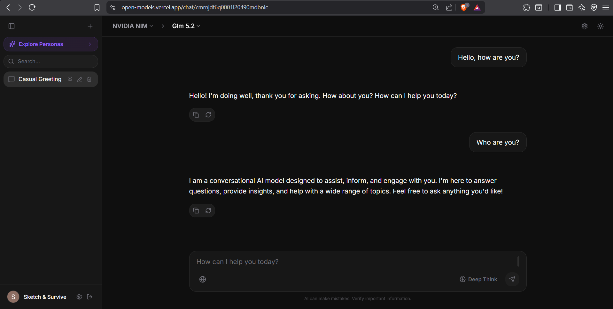

<div align="center">

<table align="center">
<tr><td align="center">

```
 ██████╗ ██████╗ ███████╗███╗   ██╗███╗   ███╗ ██████╗ ██████╗ ███████╗██╗     ███████╗
██╔═══██╗██╔══██╗██╔════╝████╗  ██║████╗ ████║██╔═══██╗██╔══██╗██╔════╝██║     ██╔════╝
██║   ██║██████╔╝█████╗  ██╔██╗ ██║██╔████╔██║██║   ██║██║  ██║█████╗  ██║     ███████╗
██║   ██║██╔═══╝ ██╔══╝  ██║╚██╗██║██║╚██╔╝██║██║   ██║██║  ██║██╔══╝  ██║     ╚════██║
╚██████╔╝██║     ███████╗██║ ╚████║██║ ╚═╝ ██║╚██████╔╝██████╔╝███████╗███████╗███████║
 ╚═════╝ ╚═╝     ╚══════╝╚═╝  ╚═══╝╚═╝     ╚═╝ ╚═════╝ ╚═════╝ ╚══════╝╚══════╝╚══════╝
```

</td></tr>
</table>

<p align="center"><b>The premium, open-source AI playground & chat interface</b></p>
<p align="center"><b>Multi-provider support. Standalone compilation sandbox. Zero overhead.</b></p>

<p align="center">
  <a href="https://open-models.vercel.app">🚀 <b>Live Demo: open-models.vercel.app</b></a>
</p>

<p align="center">
  <a href="https://github.com/krishcodes07/openmodels"></a>
  <a href="LICENSE"></a>
  <a href="https://react.dev"></a>
  <a href="https://tailwindcss.com"></a>
  <a href="https://www.postgresql.org"></a>
</p>

</div>

[](https://open-models.vercel.app)

---

## Why OpenModels?

Most AI chat playgrounds lock you into a single provider or force you to rely on external servers to route your queries. **OpenModels gives you absolute control over your key infrastructure.** Connect directly to 13+ endpoints, manage sessions client-side without registration, or sign in to persist database history. 

- **Zero-Middleman Routing** — Connect directly to APIs (NVIDIA NIM, Groq, Gemini) using default keys or bring-your-own credentials.
- **Standalone Development Sandbox** — Write HTML/CSS/JS/SVG and compile/preview it in a secure, isolated container instantly.
- **Secure Encrypted Storage** — User-provided API keys are encrypted at rest using industry-grade **AES-256-GCM** on the backend.

---

## Two components, one repository

| Component | Path | Technical Stack |
| --- | --- | --- |
| **React Client** | `client/` | React 19, Vite 8, Zustand (Sliced store), Monaco Editor, TailwindCSS v4 |
| **Express Server** | `server/` | Node.js, Express 4, Prisma (PostgreSQL), AES-256-GCM, Server-Sent Events (SSE) |

---

## Features

- **🔌 13+ Built-in Providers** — Seamlessly query NVIDIA NIM, Gemini, Groq, OpenRouter, Mistral, GitHub Models, Together, SambaNova, Cerebras, Cohere, Cloudflare Workers, Z.AI, and Agens AI.
- **🛠️ Standalone Compilation Sandbox** — Run HTML, CSS, JavaScript, and SVG codes directly within an inline frame. Includes Monaco Editor, hot reloading (800ms debounce), and client-side downloads.
- **🔍 Web Search & Deep Think** — Enhance queries with real-time web search results (powered by Firecrawl) and Deep Thinking/Reasoning models (e.g., DeepSeek R1).
- **🔒 AES-256-GCM Encryption** — Secure API keys stored in user settings. Keys are encrypted with a unique IV and authentication tag before insertion.
- **👤 Guest Session Persistence** — Chat instantly without signing up. Guest sessions save up to 5 messages to local state/IndexedDB.
- **🗂️ Message Versioning & Editing** — Edit past user prompts, navigate through alternative generation branches, and trigger hot regenerations.
- **🎭 System Personas** — Seed custom personas or utilize default system presets (seeded on startup) to guide AI responses.
- **📱 Responsive Layout** — Compact headers, scroll-independent panels, and responsive navigation drawers designed for viewports down to 320px.

---

## Quick start

```bash
# Clone the repository
git clone https://github.com/krishcodes07/openmodels.git
cd openmodels

# Install root dependencies
npm install

# Setup environment variables
cp .env.example .env
# Edit .env with your DATABASE_URL, JWT_SECRET, and ENCRYPTION_KEY

# Initialize database schema (Prisma)
cd server
npm install
npx prisma generate
npx prisma db push

# Start both client and server concurrently
cd ..
npm run dev
```

- **Frontend**: [http://localhost:5173](http://localhost:5173) (Proxies `/api` requests to 3001)
- **Backend API**: [http://localhost:3001](http://localhost:3001)

---

## Supported Providers & Capabilities

| Provider | ID | Vision | Deep Think | Web Search | Recommended Env Key |
| --- | --- | :---: | :---: | :---: | --- |
| **NVIDIA NIM** | `nvidia` | ✅ | ✅ | ✅ | `NVIDIA_API_KEY` |
| **Groq** | `groq` | ❌ | ✅ | ✅ | `GROQ_API_KEY` |
| **Google Gemini** | `gemini` | ✅ | ✅ | ✅ | `GEMINI_API_KEY` |
| **OpenRouter** | `openrouter` | ✅ | ✅ | ✅ | `OPENROUTER_API_KEY` |
| **Mistral AI** | `mistral` | ✅ | ❌ | ✅ | `MISTRAL_API_KEY` |
| **GitHub Models** | `github` | ✅ | ✅ | ✅ | `GITHUB_API_KEY` |
| **SambaNova** | `sambanova` | ❌ | ❌ | ✅ | `SAMBANOVA_API_KEY` |
| **Cerebras** | `cerebras` | ❌ | ❌ | ✅ | `CEREBRAS_API_KEY` |
| **Cloudflare AI** | `cloudflare` | ❌ | ❌ | ✅ | `CLOUDFLARE_API_TOKEN` |
| **Cohere** | `cohere` | ❌ | ❌ | ✅ | `COHERE_API_KEY` |
| **Z.AI** | `zai` | ✅ | ❌ | ✅ | `ZAI_API_KEY` |
| **Agens AI** | `agnes` | ❌ | ❌ | ✅ | `AGNES_API_KEY` |

---

## Permissions & Sandboxing

**Secure execution by default.** OpenModels runs all compiled web previews inside an isolated `<iframe>` with strict security constraints:

```html
<iframe srcDoc={srcDoc} sandbox="allow-scripts allow-modals" />
```

By omitting the `allow-same-origin` flag, the compiled preview cannot access your host cookies, localStorage, IndexedDB, or session tokens, completely isolating potential XSS vulnerabilities from the main application.

---

## Documentation

| Topic | Link |
| --- | --- |
| System Architecture | [docs/architecture.md](docs/architecture.md) |
| Local Setup Guide | [docs/getting-started.md](docs/getting-started.md) |
| Adding a Custom Provider | [docs/provider-guide.md](docs/provider-guide.md) |
| Interactive Sandbox Engine | [docs/sandbox-preview.md](docs/sandbox-preview.md) |
| Authentication & Credentials Encryption | [docs/auth-and-security.md](docs/auth-and-security.md) |
| Production Deployment Manual | [docs/deployment.md](docs/deployment.md) |
| Contributing | [CONTRIBUTING.md](CONTRIBUTING.md) |

---

## License

This project is licensed under the MIT License.
