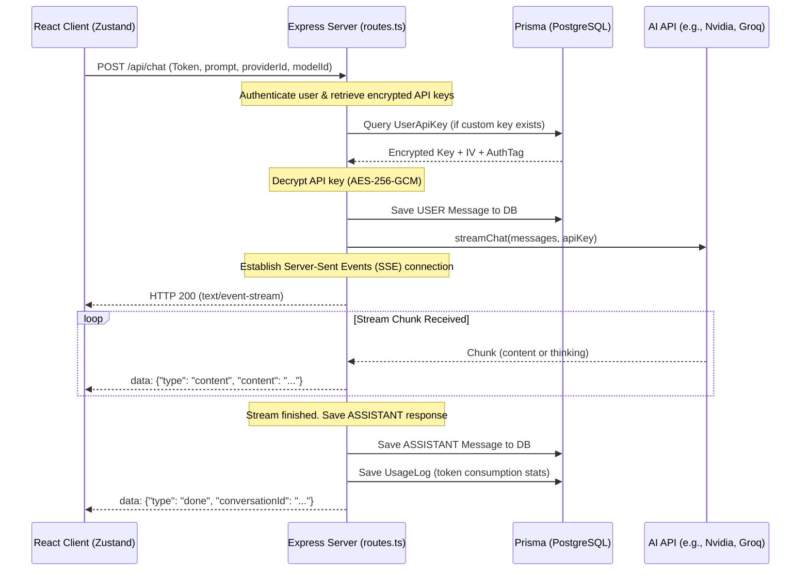

# OpenModels Architecture Guide

OpenModels is designed as a modular, feature-oriented, multi-provider AI chat application. This document details the architectural patterns, data flow, database schemas, and protocols that govern both the client and server.

---

## 🏛️ Monorepo Structure

The project is structured as a light monorepo, keeping the client and server codebase distinct but easy to run simultaneously using a single root npm command.

```
openmodels/
├── client/           # React + TypeScript + Vite frontend
├── server/           # Express + TypeScript + Prisma backend
├── api/              # Vercel serverless functions wrapper
├── docs/             # Technical and operational documentation
├── learnings/        # Local AI context logs and history files
├── specs/            # Project specification documents
├── package.json      # Workspace orchestration script (concurrently)
└── vercel.json       # Production rewrite routing rules
```

---

## 💻 Tech Stack & Dependencies

### Frontend (Client)
- **Core Framework**: React 19 (managed via Vite 8 for fast building and HMR)
- **Language**: TypeScript
- **Styling**: TailwindCSS v4 (using the `@tailwindcss/vite` compiler plugin instead of PostCSS config files)
- **Routing**: React Router DOM v7
- **State Management**: Zustand (modular, sliced store pattern in `client/src/stores/chat`)
- **UI Components & Icons**: Lucide React
- **Markdown Rendering**: React-Markdown + Remark-GFM (support for tables, checkboxes, lists)
- **Syntax Highlighting**: Prism.js (used in code blocks and sandbox panels)

### Backend (Server)
- **Runtime**: Node.js (v18+) with TypeScript (using `tsx` for hot-reload in development)
- **Framework**: Express 4
- **Database**: PostgreSQL (managed using Prisma Client ORM)
- **Authentication**: JWT (Access Token in memory/localStorage + Refresh Token via HTTP-only cookie)
- **Encryption**: Built-in Node `crypto` library (AES-256-GCM) to secure user-provided API keys
- **AI SDK**: OpenAI Node SDK (serves as the universal API client wrapper for all OpenAI-compatible API providers)
- **File Uploads**: Multer (configured with in-memory storage for handling images and prompt payloads)

---

## 🔄 Client-Server Data Flow



### Server-Sent Events (SSE) Protocol
OpenModels communicates AI text output in real time using Server-Sent Events rather than WebSockets. This simplifies infrastructure, supports serverless edge deployments, and works natively over HTTP.
The `/api/chat` route responds with headers:
```http
Content-Type: text/event-stream
Cache-Control: no-cache
Connection: keep-alive
```
During the chat session, it fires JSON payloads with different event types:
1. `info`: Meta configurations (e.g. `usingServerKey: true`).
2. `sources`: If Web Search was active, sends parsed list of website sources.
3. `thinking`: Reasoning steps from Deep Think models (e.g. DeepSeek R1).
4. `content`: Standard content chunk generated by the model.
5. `title`: Created by background AI summarizing the topic (only for new conversations).
6. `done`: Stream complete, database state is persistent.
7. `error`: Emits standard error descriptions.

---

## 🗄️ Database Schema & Models

Prisma ORM connects the system to PostgreSQL. The schema is organized into four main areas:

1. **User & Auth**:
   - `User`: Primary user records, emails, verification codes, name, and OAuth references.
   - `UserSettings`: Global settings dashboard mapping defaults (default model, custom system prompt, UI themes).
2. **Conversations**:
   - `Conversation`: Links messages to a parent history. Stores active metadata like which provider or model is currently set.
   - `Message`: Stores conversation texts. Supports fields like `thinkingContent` for reasoning, `imageUrls` for vision models, and regeneration parameters like `parentMessageId` and `userContent` to support prompt editing and message versioning.
3. **Usage Logs**:
   - `UsageLog`: Captures prompt, completion, and total token parameters for billing or metrics. Logs whether Firecrawl Web Search was active.
4. **Security & Credentials**:
   - `UserApiKey`: An entry linking a user to specific providers (Nvidia, Groq, Mistral, etc.). Stores the API keys as hex-encoded ciphertexts encrypted using AES-256-GCM.

---

## 🎨 Frontend State Architecture

Zustand manages the frontend client state, using slice state division in `client/src/stores/chat`:
- `anonymousSlice.ts`: Guest limits and local storage message histories.
- `messageSlice.ts`: Message histories, active conversation loads, edit/regeneration controls, and text stream compilation.
- `modelSlice.ts`: Dynamic list of providers and models from the `/api/providers` endpoint.
- `personaSlice.ts`: User-built and preset system personas.
- `sandboxSlice.ts`: Code parsing, rendering target selectors, and Monaco editor states.
- `themeSlice.ts`: Themes ("dark", "light", custom themes) stored inside browser variables.
