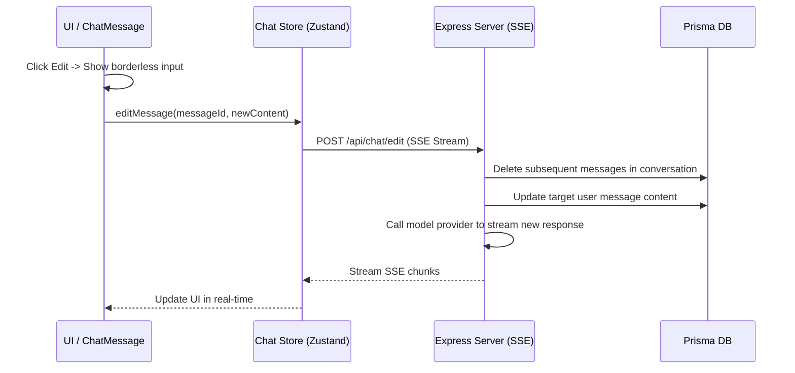
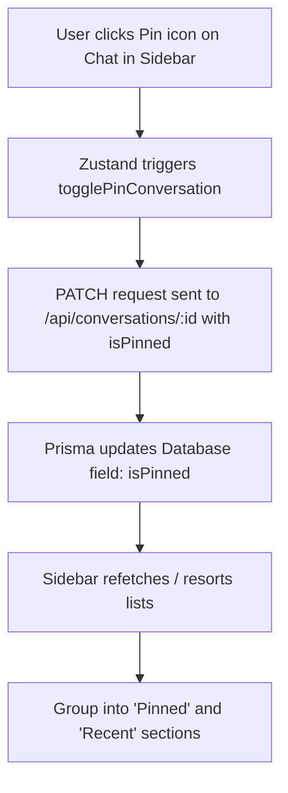

# Learning: Implementing Message Editing and Conversation Pinning Features

We successfully implemented the "Message Editing" and "Conversation Pinning" features across the database schema, Express backend routing, Zustand store, and Tailwind UI components. Below is a detailed breakdown of the architecture, implementation choices, and key learnings.

---

## 1. Architecture Overview

### Message Editing Flow

### Conversation Pinning Flow

---

## 2. Technical Implementation Details

### Message Editing
1. **Clean Conversation Truncation**: When editing a past user prompt, the conversation history downstream must be discarded to keep the context coherent. The backend deletes all messages created *after* the target message before triggering the new stream response.
2. **ChatGPT Replica UI**:
   - **Editing Bubble**: Replaces the active message bubble with a borderless `textarea` wrapped inside a `rounded-2xl bg-bg-secondary` box.
   - **Controls**: Restructures the "Cancel" and "Send" buttons as pill-shaped (`rounded-full`) elements aligned inside the bottom-right corner of the active bubble.
   - **Keyboard Shortcut**: Supports `Ctrl + Enter` (and `Cmd + Enter`) inside the textarea to quickly submit edits.
3. **SSE Streaming Support**: The frontend store implements `api.streamEdit` to feed real-time streaming tokens back into the active UI state.

### Conversation Pinning
1. **Database Schema**: Added `isPinned Boolean @default(false)` to the Prisma `Conversation` model.
2. **API & Database Sorting**: Fetching conversations retrieves lists sorted by `isPinned: desc` first, and then by `updatedAt: desc`.
3. **Structured Sidebar UI**:
   - Split filtered chats into `pinnedConvs` and `unpinnedConvs`.
   - Display a dedicated **PINNED** section at the very top of the sidebar when pinned chats exist.
   - Add hover states to toggle pinning, as well as static pin indicators on pinned chats.

---

## 3. Key Takeaways

1. **Destructive History Truncation**: In chat systems, editing past prompts requires truncating future messages from that point onward to prevent the model from seeing contextually disjointed history.
2. **Design Fidelity**: Restructuring inputs as borderless and container-aligned elements provides a premium, clean user experience mimicking leading chat applications (like ChatGPT).
3. **Composite Sorting**: When introducing priority items (pinned chats), composite sorting (`isPinned DESC, updatedAt DESC`) is crucial to keep the most recently active pinned chats sorted correctly at the top, followed by recent unpinned chats.
