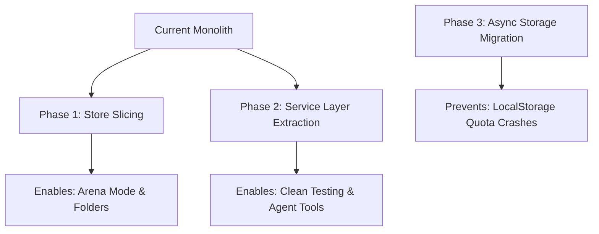

# Codebase Refactoring & Future-Proofing Plan

To ensure that the upcoming upgrades (such as **Multi-Model Arena Mode**, **Collapsible Folder Organization**, **Shortcuts**, and **Voice dictation**) are clean and painless to implement, we analyzed the frontend and backend architectures of OpenModels. Below is a detailed report outlining key bottlenecks, potential edge-case bugs, and recommended refactoring patterns.

---

## 1. Architectural Bottlenecks & Code Smells

### A. Monolithic Zustand Store (`client/src/stores/chatStore.ts`)
* **The Smell**: At **1,685 lines**, the main chat store contains all global variables, anonymous UI sync states, Server-Sent Event stream connections, version-switching controllers, database fetching, and sandbox mutations.
* **Why it hurts future upgrades**: 
  - Adding **Arena Mode** (which requires managing *multiple active stream processes* and *concurrent response comparisons* for the same user prompt) will clutter this store with complex concurrent-streaming loops.
  - Adding **Folders** will require custom folder CRUD actions, drag-and-drop state, and filtering, compounding the store's size.
* **Recommended Refactoring**:
  - Split the store into smaller, focused slices using Zustand's slice pattern (e.g., `createSandboxSlice`, `createStreamingSlice`, `createAnonymousSlice`, `createFolderSlice`).
  - Move complex asynchronous operations (like SSE streaming and processing message tokens) out of the store definition into pure utility functions or custom React hooks (e.g., `useChatStream`).

### B. Route-Based Controllers (`server/src/features/chat/routes.ts`)
* **The Smell**: Express routes (891 lines) handle request validation, database access (Prisma), SSE connection setup, third-party search execution (Firecrawl/Google Search), encryption decryption, and token management inline.
* **Why it hurts future upgrades**: 
  - Adding new AI tools, custom agent structures, or multi-step reasoning capabilities would require overloading the `/api/chat` route handler with nested callback loops.
  - Testing endpoints without running database mocks or live LLM streams is highly difficult.
* **Recommended Refactoring**:
  - Delegate route operations to a Service Layer (e.g., `ChatService.ts`, `SearchService.ts`, `ModelService.ts`).
  - Keep route files thin (under 100 lines), containing only validation schemas and service dispatch mappings.

---

## 2. Potential Bugs & Edge Cases

### A. Stream Interruption Mismatch (Temp ID vs Real ID)
* **The Bug**: When sending a message in a brand new chat, the client UI generates a temporary prompt ID (`pending-...`). The AbortController is mapped using this temporary ID. If the user clicks **Stop** before the server responds with the actual database-created conversation ID, the `activeStreams` map lookup might fail or hold a stale key, causing the upstream LLM stream to leak tokens on the server.
* **Fix**: Ensure that the AbortController mapping handles both the temporary and real ID maps or maps streams directly to a persistent, client-side session key.

### B. Anonymous Chat LocalStorage Size Limit
* **The Bug**: Anonymous chats are synced synchronously into `localStorage` (via `JSON.stringify` inside the Zustand action). As a user's local message history grows over time:
  - Reading/writing to `localStorage` will block the main JavaScript thread, causing temporary UI lag or stuttering during stream updates.
  - Exceeding the 5MB browser quota will throw unhandled write quota errors, causing the app to crash or stop saving chats.
* **Fix**:
  - Implement a simple threshold/garbage collector that automatically removes the oldest local conversations if local storage size approaches 4MB.
  - Transition anonymous storage to **IndexedDB** (using lightweight libraries like `localForage` or `idb`) for asynchronous, high-capacity, non-blocking storage.

### C. Concurrent SSE Connection Leaks
* **The Bug**: When switching fast between conversations while a message is actively streaming, if the previous stream is not aborted gracefully, the browser connection might stay open in the background (or block client socket pools due to HTTP/1.1 limits).
* **Fix**: Add a safety cleaner in `useEffect` when switching pages that calls `stopResponse` for the previous conversation, forcing the client connection to close immediately.

---

## 3. Recommended Refactoring Milestones

1. **Phase 1: Store Slicing (Frontend)**: Break up `chatStore.ts` into a `slices/` folder.
2. **Phase 2: Service Layer Extraction (Backend)**: Move SSE parsing, search logic, and Prisma operations out of `/api/chat` routes.
3. **Phase 3: IndexedDB Migration**: Prevent local database exceptions for non-authenticated users.
